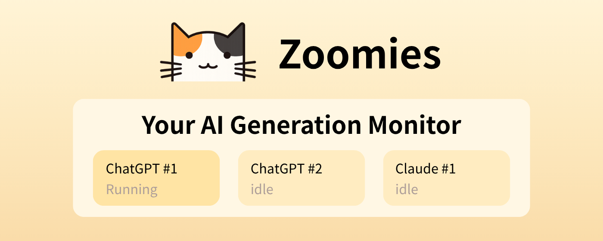

<strong><em style="font-size: 36px;">Zoomies: A cat monitor that helps you track AI generation status across browser tabs.</em></strong>

[<a href="https://chromewebstore.google.com/detail/jekbjoplbllcogkiledgbkjgallkonmp?utm_source=item-share-cb">Install link</a>]
[<a href="./README.zh.md">中文</a>]
 

A Chrome Manifest V3 extension that monitors whether AI sites are generating output and shows a status cat at the bottom-right of the page.

## Supported Sites
- ChatGPT: `chatgpt.com`, `chat.openai.com`
- Gemini: `gemini.google.com`
- Claude: `claude.ai`
- DeepSeek: `chat.deepseek.com`, `deepseek.com`, `www.deepseek.com`
- Kimi: `kimi.moonshot.cn`, `kimi.com`, `www.kimi.com`

## Core Features (Current Implementation)
- Per-site adapter based generation detection (`generating` / `idle`).
- Cross-tab aggregation with per-instance labels (for example, `ChatGPT #1`, `ChatGPT #2`).
- Floating panel injected on all pages (`<all_urls>`) for global status visibility.
- UI language follows browser language automatically (`zh*` -> Chinese, others -> English).
- Bottom-right cat animations:
  - `running` while any instance is generating.
  - `notify` when an instance transitions from generating to idle.
- Extension icon badge:
  - Shows running instance count (up to `99+`).
  - Temporarily shows `!` when an instance just finished.
- Collapsible panel (cat-only mode) with persisted state.
- No chat content collection or storage.

## Detection Strategy
- Explicit signals first: Stop/Send controls and composer/input area cues.
- Heuristic fallback:
  - Minimum switch interval (debounce) to reduce flicker.
  - Auto-fallback to idle after generating signal timeout.
  - Auto-fallback to idle after prolonged DOM inactivity.

Key constants (see `src/content/main.js`):
- `MIN_SWITCH_MS = 700`
- `IDLE_BY_INACTIVITY_MS = 2200`
- `CHECK_INTERVAL_MS = 900`

## Project Structure
- `manifest.json`: MV3 manifest (permissions, injections, background worker)
- `src/common/protocol.js`: message types, site constants, status constants
- `src/background/worker.js`: cross-tab aggregation, badge updates, completion broadcasts
- `src/content/main.js`: site detection, status detection, overlay UI
- `src/assets/cat.png`: cat asset

## Message Protocol
- `STATUS_CHANGED`: content script reports tab status changes
- `REQUEST_STATE`: content script requests current aggregate snapshot
- `CAT_STATE_UPDATE`: background broadcasts aggregate state
- `SITE_DONE`: broadcast when an instance finishes
- `REGISTER_VIEW`: reserved (currently unused)

## Local Storage Keys
- `siteEnabled`: `{ chatgpt, gemini, claude, deepseek, kimi }` (default all enabled)
- `debug`: `boolean` (default `false`)
- `catCollapsed`: `boolean` (panel collapsed state)

## Installation (Developer Mode)
1. Open `chrome://extensions`
2. Enable **Developer mode**
3. Click **Load unpacked**
4. Select this directory: `/Users/boyuanwang/Project/gpt_cctv`

## Known Limitations
- DOM and keyword heuristics may require selector updates when target sites change UI.
- The extension injects into `<all_urls>`, but active detection only runs on supported AI sites.
- No desktop notification or sound alert in the current version.
